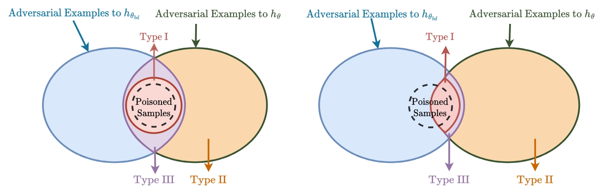

# Shared Adversarial Unlearning: Backdoor Mitigation by Unlearning Shared Adversarial Examples

[English](./README.md) | [简体中文](./README_cn.md)

[Paper](https://openreview.net/pdf?id=zqOcW3R9rd) | [Citation](#citation)

---

## 📢 News

**Updated 2024-10-11**: The SAU method has now been integrated into [BackdoorBench](https://github.com/SCLBD/BackdoorBench). Users can directly obtain and utilize our method within the platform for testing defenses against backdoor attacks.

---

## 📝 Introduction

Welcome to the official repository for the NeurIPS 2023 paper titled "Shared Adversarial Unlearning: Backdoor Mitigation by Unlearning Shared Adversarial Examples". This project introduces a novel defense mechanism against malicious backdoor attacks in machine learning models.

---

## 📊 Overview

In this paper, we address the challenge of purifying a backdoored model using a small clean dataset. By linking backdoor risk with adversarial risk, we derive a new upper bound for backdoor risk, primarily focusing on the risk posed by shared adversarial examples (SAEs) between the backdoored and purified models. This discovery leads us to formulate a novel bi-level optimization problem for backdoor mitigation through adversarial training techniques. To tackle this problem, we propose Shared Adversarial Unlearning (SAU). SAU first generates SAEs and subsequently unlearns them so that they are correctly classified by the purified model and/or differently classified by both models, thereby reducing the backdoor effect. Our experiments across various benchmarks and network architectures demonstrate that SAU achieves state-of-the-art performance in defending against backdoors.



---

## 🛠️ Setup Instructions

To start working with this project:

1. **Clone Repository**:
    ```bash
    git clone https://github.com/shawkui/Proactive_Defensive_Backdoor.git
    cd Proactive_Defensive_Backdoor
    ```

2. **Install Dependencies**:
    ```bash
    pip install -r requirements.txt
    ```

---

## ⚙️ Usage

### 🧪 Performing an Attack

Simulate an attack scenario using the command:
```bash
python attack/badnet.py --save_folder_name badnet_demo
```

### 🛡️ Applying SAU Defense Mechanism

After setting up the attack scenario, apply the SAU defense with:
```bash
python defense/sau.py --result_file badnet_demo
```

---

## 📄 Citation

If you find our work valuable and use it in your research, please cite our paper using the following BibTeX entry:

```bibtex
@inproceedings{wei2023shared,
title={Shared Adversarial Unlearning: Backdoor Mitigation by Unlearning Shared Adversarial Examples},
author={Wei, Shaokui and Zhang, Mingda and Zha, Hongyuan and Wu, Baoyuan},
booktitle={Thirty-seventh Conference on Neural Information Processing Systems},
year={2023},
url={https://openreview.net/forum?id=zqOcW3R9rd}
}
```

---

## 🎖️ Acknowledgment

Our code is built upon [BackdoorBench](https://github.com/SCLBD/BackdoorBench), *"BackdoorBench: A Comprehensive Benchmark of Backdoor Learning"*. If you find their work useful, consider giving them a star.

---

## 📞 Contact

For any inquiries or feedback, feel free to open an issue or reach out via email at `shaokuiwei@link.cuhk.edu.cn`.

---
