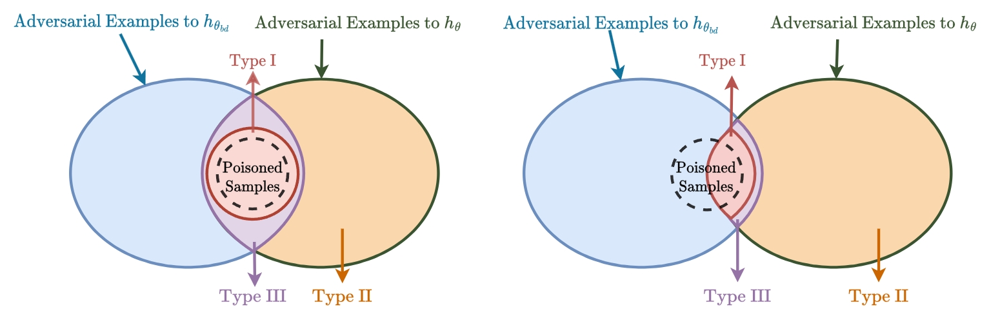

# 共享对抗性遗忘：通过遗忘共享对抗样本来缓解后门攻击

[English](./README.md) | [简体中文](./README_cn.md)

[论文](https://openreview.net/pdf?id=zqOcW3R9rd) | [引用](#citation)


---
## 📢 新闻

**2024-10-11 更新**: 目前，SAU 方法已集成到 [BackdoorBench](https://github.com/SCLBD/BackdoorBench) 中，用户可以直接在该平台上获取并使用我们的方法进行后门攻击的防御测试。

---

## 📝 引言

欢迎来到我们 NeurIPS 2023 论文《共享对抗性遗忘：通过遗忘共享对抗样本来缓解后门攻击》的官方仓库。本项目介绍了一种针对机器学习模型中恶意后门攻击的新防御机制。

---

## 📊 概览

在本文中，我们探讨了使用小规模干净数据集净化被植入后门模型的问题。通过建立后门风险与对抗风险之间的联系，我们推导出一个新的后门风险上界，主要关注被植入后门模型与净化模型之间共享对抗样本（SAEs）的风险。这一发现促使我们提出了一个利用对抗训练技术缓解后门的新双层优化问题。为了解决这个问题，我们提出了一种名为 Shared Adversarial Unlearning (SAU) 的方法。具体来说，SAU 首先生成 SAEs，然后对这些生成的 SAEs 进行遗忘处理，使得它们要么被净化模型正确分类，要么由两个模型分类不同，从而减弱被植入后门模型中的后门效应。实验表明，在多种基准数据集和网络架构上，我们的方法达到了最先进的后门防御性能。



---


## 🛠️ 安装指南

要开始使用此项目：

1. **克隆仓库**：
    ```bash
    git clone https://github.com/shawkui/Proactive_Defensive_Backdoor.git
    cd Proactive_Defensive_Backdoor
    ```

2. **安装依赖**：
    ```bash
    pip install -r requirements.txt
    ```

---

## ⚙️ 使用说明

### 🧪 模拟攻击

运行以下命令来模拟攻击场景：
```bash
python attack/badnet.py --save_folder_name badnet_demo
```

### 🛡️ 应用 SAU 防御机制

设置完攻击场景后，应用 SAU 防御机制：
```bash
python defense/sau.py --result_file badnet_demo
```

---

## 📄 引用

如果您觉得我们的工作有价值，并在您的研究中使用了它，请使用以下 BibTeX 条目引用我们的论文：

```bibtex
@inproceedings{wei2024mitigating,
  title={Mitigating Backdoor Attack by Injecting Proactive Defensive Backdoor},
  author={Wei, Shaokui and Zha, Hongyuan and Wu, Baoyuan},
  booktitle={Thirty-eighth Conference on Neural Information Processing Systems},
  year={2024}
}
```

---

## 🎖️ 致谢

我们的代码大量依赖于 [BackdoorBench](https://github.com/SCLBD/BackdoorBench)，即“后门学习的综合基准”。如果他们的工作对您有用，请考虑给他们点个星。

---

## 📞 联系方式

如有任何问题或反馈，欢迎创建 Issue 或通过电子邮件 `shaokuiwei@link.cuhk.edu.cn` 联系我们。

---
